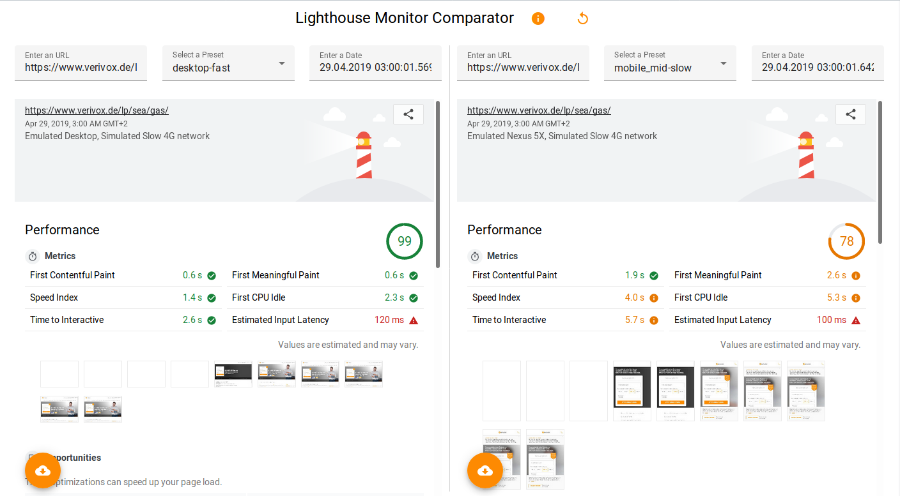

# Lighthouse Monitor


A lighthouse server, reporter and comparator to monitor multiple sites




## Why

Lighthouse is a very extensive performance monitor and Google provides it's own public instance through their webpage speedtest. But those results do not give any hint on the hardware used behind the scenes and are not exportable. And what do you do with the results of your self-run lighthouse instance? How do you ensure having enough historic data to see an optimization journey? How do you get the reports into other monitoring systems like Prometheus or Grafana Dashboards?

Lightmon provides exactly that:

* running lighthouse regularly against
  * a set of URLs, with
  * a set of profiles (e.g. desktop-on-cable, mobile-on-3G, mobile-on-LTE)
* a webserver to easily choose and compare reports for
  * different URLs,
  * different profiles, and
  * different times
* automatically cleanup older reports with intelligent retention 
  * squash intra-daily reports to one per URL, profile and day after x days
  * squash intra-weekly reports to one per URL, profile and week after y weeks
* multiple report receivers / connectors to other data analyzation and retention systems like
  * Directory
  * New Relic
  * Prometheus
* easily extendable through programmatic use of lighthouse
  * easily add pages or different profiles for each page
  * send extra-headers to specific URLs (e.g. for authentication)
  * add a report receiver to alert on errors
  * ...
* runs on every major OS or headless in docker


## Requirements

* Node 10+
* chromium or chrome v54+
* disk-space


## Usage

1. install dependencies: `npm ci`
2. run an evaluation to evaluate a standard url set: `npm run evaluation`
3. run the webserver to view the results: `npm run server` open [http://localhost:3000](http://localhost:3000)
4. run cleanup: `npm run cleanup`


## Architecture

The system consists of two components: a *webserver* to view reports and *evaluators* to evaluate websites. The former can run continuously, the latter needs to be scheduled (e.g. via a cronjob).

You can run all of them on the same machine, but to keep the results consistent, you should consider splitting the webserver and evaluator.

If you plan to scale up, see the section "Operation Considerations" in this document.


## Configuration

Because we prefer *code over configuration*, we use javascript files that export the configuration. Therefore, the primary way of configuring Lightmon is through javascript configuration files - but it's easy to inject secret variables via environment variables.

Copy over `config/sample.js` to `config/local.js` and edit it according to your needs.

Have a look at `config/default.js` for the defaults we set and how everything ties together. If you would like to add environment support or a more complex setup, this is also the main file to look at.


## Contributing

We are open for pull-requests and contributions.

During evaluation, we'll check if

* your PR has a proper test coverage,
* test suite is green (`npm run test:all`), and
* no linting errors are present (`npm run lint`)

You can check everything by running `npm run preflight`.


## Environment Variables

* `CHROME_PATH` to select the chrome installation manually
* `NO_HEADLESS` to show the browser in the foreground (will not work in docker)
* `PUPPETEER_SKIP_CHROMIUM_DOWNLOAD` to any value in order to avoid unnecessary downloads of chrome
* `REPORT_DIR` changes directory for output of reports
* `DEBUG` you can set the output level by specifying e.g. `export DEBUG='LIGHTMON:*'`


## Report Receivers

There are several receivers you can configure to your liking in the aforementioned [config/local.js](./config/local.js).

They are initialized during the configuration phase and will receive each report, after it has been returned by lighthouse.

You can easily create your own receiver - have a look at these default receivers for examples.


### Timestamped-Directory

This receiver takes a base directory (e.g. "reports/") as `reportDir` in the config file or as `REPORT_DIR` as environment variable. Under it, a timestamped directory for one run over all defined urls will be created with the following structure:

```text
+- reports/
   +- 2018-07-15T17:22:01.423Z/
      +- vx-energy_mobile-fast_artifacts.json.gz
      +- vx-energy_mobile-fast_config.json.gz
      +- vx-energy_mobile-fast_report.json.gz
      +- [...]
```

The general form is `<url-name>_<preset>_[artifacts|config|report].json.gz`.

You can view the reports of the *directory-receiver* in the [Lighthouse Viewer](https://googlechrome.github.io/lighthouse/viewer/).


### Directory

Same as above, but it will not create a timestamped directory - the filestructure will be in the given target directory.


### New Relic

This will push the results into [NewRelic](https://www.newrelic.com). Required configuration:

* `NEW_RELIC_API_KEY` - your api key in New Relic
* `NEW_RELIC_ACCOUNT_ID` - the account id of where to save the reports

Alternatively, you can give the local configuration by overwriting receivers in a [config/local.js](./config/local.js).


### Prometheus

[Prometheus](https://prometheus.io) is a monitoring system, which pulls (*scrapes*) data from different sources. The data will be available if you activate the Prometheus Receiver under the `/metrics` path of the webserver. It does not require any configuration.

If you want to develop against prometheus, you can run a dockerized scraper, which will try to scrape your hosts port 9099 by running `tools/prometheus/start-docker.sh`. Please use the receiver *WebPrometheus* instead of *Prometheus*, which will start it's own express endpoint on that port.


### Implementing your own

Implementing your own receiver is dead simple. Create a new class that implements one method:

```javascript
// my-receiver.js
class MyReceiver {
    constructor(options) {
        // whatever options you need to give to the receiver
    }
    
    async receive(report, config) {
        // handle report and config
    }
}

module.exports = { MyReceiver }
```

Then register your new receiver in the configuration file:

```javascript
// config/local.js
const { MyReceiver } = require('my-receiver')

const receivers = [
    new MyReceiver()
]

module.exports = {
    receivers
}
```

That's it - if you want to keep the default receivers, just add them to the array.


## Operation Considerations

Running Lightmon is quite simple and runs nice on one node - however, in our tests we found quite some variance in the results when running evaluations in parallel. This is why every URL and every profile is not tested in parallel, but sequentially.

To perform the tests in parallel, we suggest to run the webserver and evaluation nodes separately (not to mention other services like prometheus). If you want to run the webserver, every node needs access to a common data store, which supports the linux [Inotify](https://en.wikipedia.org/wiki/Inotify) interface - both samba-shares as well as windows-shares work fine.


### Storage considerations

The necessary storage can grow quite big very fast - the necessary storage depends on

* the number of URLs to check,
* the number of profiles,
* the size of the URL resources,
* the number of tests, and
* the retention policy

All resources are gzipped by default to keep the size down. Here at Verivox, we test ~60 URLs with 3 profiles on an hourly basis, with a good mix of static pages and rich-client web-applications and on average, we get 3.5mb of gzipped data per URL. If you want to keep an intra-daily resolution for 14 days, daily resolution for half a year and weekly resolution for 5 years, the required space is

* intra-daily: 3.5mb * 60 URLs * 24 hours * 14 days = ~70gb
* daily: 3.5mb * 60 URLs * (182-14) days = ~35gb
* weekly: 3.5mb * 60 URLs * 52 weeks * 5 years = ~54gb

We provide a cleanup script in `/bin/cleanup` to automate the process - we run this via a nightly cronjob. Remember to restart the webserver to re-read the reports.


### Hardware and OS requirements

The nodes for evaluation do not require much - one CPU and a gigabyte of RAM is enough.

The webserver itself needs more memory, since it keeps a cache of the report meta data in memory - and if you need to double that if you want to run the cleanup from the same VM. For the aforementioned specifications, we use 4gb.

Also note, that the webserver uses an efficient [file watcher](https://www.npmjs.com/package/chokidar) to handle the addition of results from evaluations, which uses the INotify interface on linux. This means, that you need to have a high amount of allowed file watchers for amount of files present - doubled, if you want to run the cleanup from the same VM. This can be increased on most linux systems via the `/etc/sysctl.conf`-file:

```
// /etc/sysctl.conf
fs.inotify.max_user_watches=524288
```

The necessary number of file watches is dependent on the same variables as the storage. Taking the same example as before with the same retention strategy, we need

* intra-daily: 3 profiles * 60 urls * 24 reports * 14 days = ~60.000
* daily: 3 profiles * 60 urls * (182-14) days = ~30.000
* weekly: 3 profiles * 60 urls * 52 weeks * 5 years = ~47.000

So, around 140.000 watchers - doubled for cleanup and add some buffer on top for good measure of other processes.


### Speed considerations and variance

Running the evaluation on your own hardware gives you full control and much better introspective into the results. But this also gives you the operational responsibility.

You must ensure a good connectivity to the tested URLs and have a lookout for network congestion.

If you run the evaluation on VMs, you must ensure that the VMs are not provisioned on different machines - if the underlying hardware CPU changes, your results will be change as well! This can usually be achieved by VM pinning.

Also, server CPUs are usually a lot better than desktop CPUs and therefore perform a lot better than your target machines. You need to accommodate for that by setting an appropriate CPU slowdown multiplier in the configuration.

The best results are achieved by getting some example laptops and smartphones, that resemble a good mixture of the hardware your customers use and run the evaluation on those. This will keep the variance between the results as low as possible.


## Authors

Written by 

* [Horst Schneider](https://kumbier.it)
* [Kim Almasan](https://kumbier.it)
* [Lars Kumbier](https://kumbier.it)


## Licence

[Licensed](./LICENSE.md) under MIT by the Verivox GmbH
